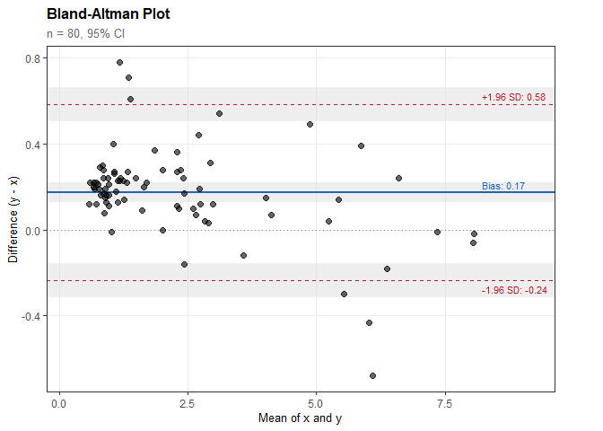
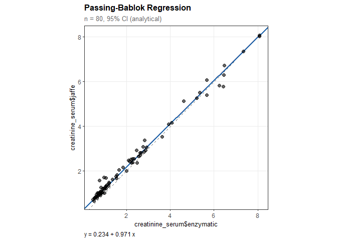
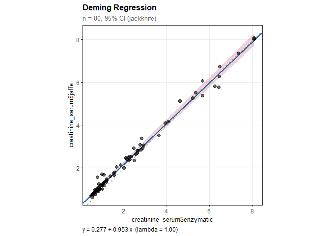
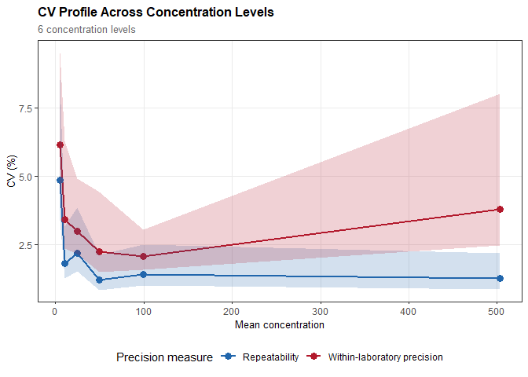
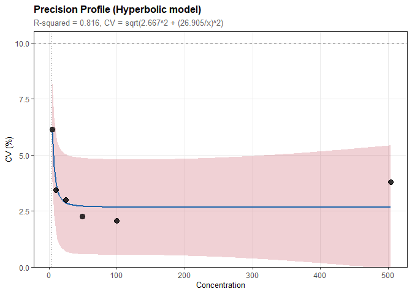

<!-- README.md is generated from README.Rmd. Please edit that file -->

# valytics 

<!-- badges: start -->

[](https://CRAN.R-project.org/package=valytics)
[](https://github.com/marcellogr/valytics/actions/workflows/R-CMD-check.yaml)
<!-- badges: end -->

Statistical methods for analytical method comparison and validation
studies. The package implements Bland-Altman analysis, Passing-Bablok
regression, Deming regression, precision experiments, and quality goal
specifications based on biological variation — approaches commonly used
in clinical laboratory method validation.

## Installation

Install valytics from CRAN:

``` r
install.packages("valytics")
```

Or install the development version from [GitHub](https://github.com/):

``` r
# install.packages("pak")
pak::pak("marcellogr/valytics")
```

## Overview

`valytics` provides tools for analytical method validation:

**Method Comparison** - **Bland-Altman analysis**: Assess agreement
through bias and limits of agreement - **Passing-Bablok regression**:
Non-parametric regression robust to outliers - **Deming regression**:
Errors-in-variables regression for method comparison

**Precision Experiments** - **Variance component analysis**:
Repeatability, intermediate precision, reproducibility - **Precision
verification**: Chi-square test against manufacturer claims -
**Precision profiles**: CV vs concentration modeling with functional
sensitivity

**Quality Specifications** - **Biological variation-based goals**:
Calculate allowable total error from CV<sub>I</sub> and CV<sub>G</sub> -
**Sigma metrics**: Six Sigma quality assessment - **Performance
assessment**: Evaluate methods against quality specifications

All methods produce publication-ready plots and comprehensive
statistical summaries.

## Method Comparison Examples

### Bland-Altman Analysis

``` r
library(valytics)

# Compare two creatinine measurement methods
data(creatinine_serum)

ba <- ba_analysis(
  x = creatinine_serum$enzymatic,
  y = creatinine_serum$jaffe
)

ba
#> 
#> Bland-Altman Analysis
#> ---------------------------------------- 
#> n = 80 paired observations
#> 
#> Difference type: Absolute (y - x)
#> Confidence level: 95%
#> 
#> Results:
#>   Bias (mean difference): 0.174
#>     95% CI: [0.127, 0.220]
#>   SD of differences: 0.209
#> 
#> Limits of Agreement:
#>   Lower LoA: -0.236
#>     95% CI: [-0.316, -0.156]
#>   Upper LoA: 0.584
#>     95% CI: [0.504, 0.663]
```

``` r
plot(ba)
```



### Passing-Bablok Regression

``` r
pb <- pb_regression(
  x = creatinine_serum$enzymatic,
  y = creatinine_serum$jaffe
)

pb
#> 
#> Passing-Bablok Regression
#> ---------------------------------------- 
#> n = 80 paired observations
#> 
#> CI method: Analytical (Passing-Bablok 1983)
#> Confidence level: 95%
#> 
#> Regression equation:
#>   creatinine_serum$jaffe = 0.234 + 0.971 * creatinine_serum$enzymatic
#> 
#> Results:
#>   Intercept: 0.234
#>     95% CI: [0.229, 0.239]
#>     (excludes 0: significant constant bias)
#> 
#>   Slope: 0.971
#>     95% CI: [0.966, 0.974]
#>     (excludes 1: significant proportional bias)
```

``` r
plot(pb)
```



### Deming Regression

``` r
dm <- deming_regression(
  x = creatinine_serum$enzymatic,
  y = creatinine_serum$jaffe
)

dm
#> 
#> Deming Regression
#> ---------------------------------------- 
#> n = 80 paired observations
#> 
#> Error ratio (lambda): 1.000
#> CI method: Jackknife
#> Confidence level: 95%
#> 
#> Regression equation:
#>   creatinine_serum$jaffe = 0.277 + 0.953 * creatinine_serum$enzymatic
#> 
#> Results:
#>   Intercept: 0.277 (SE = 0.028)
#>     95% CI: [0.222, 0.332]
#>     (excludes 0: significant constant bias)
#> 
#>   Slope: 0.953 (SE = 0.014)
#>     95% CI: [0.925, 0.982]
#>     (excludes 1: significant proportional bias)
```

``` r
plot(dm)
```



## Precision Experiments

### Variance Component Analysis

``` r
# Analyze precision from a multi-day, multi-run study
data(troponin_precision)

prec <- precision_study(
  data = troponin_precision,
  value = "value",
  sample = "level",
  day = "day",
  run = "run"
)

prec
#> 
#> Precision Study Analysis
#> --------------------------------------------- 
#> n = 120 observations
#> Design: day/run/replicate (inferred)
#> Estimation: ANOVA (Method of Moments)
#> CI method: Satterthwaite, 95% CI
#> 
#> Samples: 6 concentration levels
#> (Showing results for first sample; use $by_sample for all)
#> 
#> Precision Estimates:
#> --------------------------------------------- 
#>   Repeatability:       SD = 0.243  (CV = 4.86%)
#>                        95% CI: [0.170, 0.426]
#>   Between-run:         SD = 0.188  (CV = 3.76%)
#>                        95% CI: [0.117, 0.461]
#>   Between-day:         SD = 0.000  (CV = 0.00%)
#>                        95% CI: [0.000, 0.000]
#>   Within-laboratory precision: SD = 0.307  (CV = 6.15%)
#>                        95% CI: [0.227, 0.476]
```

``` r
plot(prec, type = "cv")
#> Warning in data.frame(sample = sample_names[i], mean_conc = if
#> (!is.null(sample_means)) sample_means[sample_names[i]] else i, : Zeilennamen
#> wurden in einer short Variablen gefunden und wurden verworfen

#> Warning in data.frame(sample = sample_names[i], mean_conc = if
#> (!is.null(sample_means)) sample_means[sample_names[i]] else i, : Zeilennamen
#> wurden in einer short Variablen gefunden und wurden verworfen

#> Warning in data.frame(sample = sample_names[i], mean_conc = if
#> (!is.null(sample_means)) sample_means[sample_names[i]] else i, : Zeilennamen
#> wurden in einer short Variablen gefunden und wurden verworfen

#> Warning in data.frame(sample = sample_names[i], mean_conc = if
#> (!is.null(sample_means)) sample_means[sample_names[i]] else i, : Zeilennamen
#> wurden in einer short Variablen gefunden und wurden verworfen

#> Warning in data.frame(sample = sample_names[i], mean_conc = if
#> (!is.null(sample_means)) sample_means[sample_names[i]] else i, : Zeilennamen
#> wurden in einer short Variablen gefunden und wurden verworfen

#> Warning in data.frame(sample = sample_names[i], mean_conc = if
#> (!is.null(sample_means)) sample_means[sample_names[i]] else i, : Zeilennamen
#> wurden in einer short Variablen gefunden und wurden verworfen
```



### Precision Profiles and Functional Sensitivity

``` r
# Model CV vs concentration relationship
prof <- precision_profile(prec, cv_target = 10)

prof
#> 
#> Precision Profile Analysis
#> ---------------------------------------- 
#> n = 6 concentration levels
#> Concentration range: 5 to 503 (100.75-fold)
#> 
#> Model: Hyperbolic
#>   CV = sqrt(2.667^2 + (26.905/x)^2)
#> 
#> Parameters:
#>   a = 2.667
#>   b = 26.905
#> 
#> Fit Quality:
#>   R-squared = 0.816
#>   RMSE = 0.578
#> 
#> Functional Sensitivity:
#>   CV = 10%: concentration = 2.792
```

``` r
plot(prof)
```



## Quality Specifications

### Allowable Total Error from Biological Variation

Calculate performance goals based on within-subject (CV<sub>I</sub>) and
between-subject (CV<sub>G</sub>) biological variation:

``` r
# Creatinine biological variation (from EFLM database)
# CV_I = 5.95%, CV_G = 14.7%
ate <- ate_from_bv(cvi = 5.95, cvg = 14.7)

ate
#> 
#> Analytical Performance Specifications from Biological Variation
#> ------------------------------------------------------------ 
#> 
#> Input:
#>   Within-subject CV (CV_I): 5.95%
#>   Between-subject CV (CV_G): 14.70%
#>   Performance level: desirable
#>   Coverage factor (k): 1.65
#> 
#> Specifications:
#>   Allowable imprecision (CV_A): 2.98%
#>   Allowable bias: 3.96%
#>   Total allowable error (TEa): 8.87%
```

### Six Sigma Quality Assessment

``` r
# Evaluate method performance
sm <- sigma_metric(bias = 1.5, cv = 2.5, tea = 10)

sm
#> 
#> Six Sigma Metric
#> ---------------------------------------- 
#> 
#> Input:
#>   Observed bias: 1.50%
#>   Observed CV: 2.50%
#>   Total allowable error (TEa): 10.00%
#> 
#> Result:
#>   Sigma: 3.40
#>   Performance: Marginal
#>   Defect rate: ~66,800 per million
```

### Performance Assessment

``` r
# Full quality assessment
assess <- ate_assessment(
  bias = 1.5, 
  cv = 2.5, 
  tea = 10,
  allowable_bias = 4.0, 
  allowable_cv = 3.0
)

assess
#> 
#> Analytical Performance Assessment
#> -------------------------------------------------- 
#> 
#>   >>> METHOD ACCEPTABLE <<<
#> 
#> Performance Summary:
#>   Parameter              Observed  Allowable     Status
#>   -------------------- ---------- ---------- ----------
#>   Bias                      1.50%      4.00%       PASS
#>   CV (Imprecision)          2.50%      3.00%       PASS
#>   Total Error               5.62%     10.00%       PASS
#> 
#> Sigma Metric: 3.40 (Marginal)
```

## Features

- **Multiple interfaces**: Vector input or formula syntax
  (`method1 ~ method2`)
- **Flexible CI methods**: Analytical, Satterthwaite, or bootstrap BCa
  confidence intervals
- **Assumption checking**: CUSUM linearity test, Shapiro-Wilk normality
  test
- **Precision analysis**: ANOVA and REML variance component estimation
- **Quality goals**: Biological variation-based specifications
  (optimal/desirable/minimum)
- **Publication-ready plots**: Built on ggplot2, fully customizable
- **Tidy workflows**: Consistent API, informative summaries

## Example Datasets

The package includes four realistic clinical datasets:

| Dataset              | Description                        | n   |
|----------------------|------------------------------------|-----|
| `glucose_methods`    | POC meter vs. laboratory analyzer  | 60  |
| `creatinine_serum`   | Enzymatic vs. Jaffe methods        | 80  |
| `troponin_cardiac`   | Two hs-cTnI platforms              | 50  |
| `troponin_precision` | hs-cTnI precision study (6 levels) | 120 |

## Vignettes

- **Method Comparison Workflow**: Step-by-step analysis guide
- **Understanding Method Comparison Statistics**: Educational overview
- **Deming Regression**: When and how to use errors-in-variables
  regression
- **Quality Goals from Biological Variation**: Setting performance
  specifications
- **Precision Profiles and Functional Sensitivity**: CV modeling and
  functional sensitivity

## References

**Bland-Altman:**

- Bland JM, Altman DG (1986). Statistical methods for assessing
  agreement between two methods of clinical measurement. *Lancet*,
  1(8476):307-310.
- Bland JM, Altman DG (1999). Measuring agreement in method comparison
  studies. *Statistical Methods in Medical Research*, 8(2):135-160.

**Passing-Bablok:**

- Passing H, Bablok W (1983). A new biometrical procedure for testing
  the equality of measurements from two different analytical methods.
  *Journal of Clinical Chemistry and Clinical Biochemistry*,
  21(11):709-720.

**Deming:**

- Linnet K (1990). Estimation of the linear relationship between the
  measurements of two methods with proportional errors. *Statistics in
  Medicine*, 9(12):1463-1473.

**Precision:**

- Chesher D (2008). Evaluating assay precision. *Clinical Biochemistry
  Reviews*, 29(Suppl 1):S23-S26.
- Kroll MH, Emancipator K (1993). A theoretical evaluation of linearity.
  *Clinical Chemistry*, 39(3):405-413.

**Biological Variation:**

- Fraser CG, Petersen PH (1993). Desirable standards for laboratory
  tests if they are to fulfill medical needs. *Clinical Chemistry*,
  39(7):1447-1453.
- EFLM Biological Variation Database: <https://biologicalvariation.eu/>

## License

GPL-3
